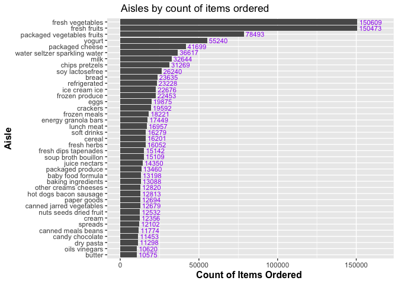

Homework 3
================
Ifrah Fayyaz

Starting assignment and loading data set:

``` r
library(tidyverse)
library(p8105.datasets)
data("instacart")
```

# Problem 1:

*Description:* The dataset for Instacart contains 15 variables and
1384617 observations. Some key variables include identifiers such as
`product_id`, `user_id` and `order_id`. Other descriptory variables
include `product_name`, `department`, `reordered` and `order_dow`. The
mean number of days between orders is 17.1 days and the most popular
department for orders is *produce*. The most ordered item has been
*Banana*.

#### How many aisles are there, and which aisles are the most items ordered from?

There are a total of 134 aisles, with the fresh vegetables aisle being
the one with the most items ordered,

#### Make a plot that shows the number of items ordered in each aisle, limiting this to aisles with more than 10000 items ordered. Arrange aisles sensibly, and organize your plot so others can read it.

``` r
instacart %>%
  count(aisle, sort = TRUE) %>%
  filter(n > 10000) %>%
  ggplot(aes(x = reorder(aisle,n), y = n)) + 
    geom_col() +
    coord_flip() +
    labs(x = "Aisle", y = "Count of Items Ordered ", title = "Aisles by count of items ordered") +
    geom_text(aes(label = n), hjust = -0.1, colour = "purple", size = 3) +
    scale_y_continuous(limits = c(-1, 165500)) +
    theme(plot.title = element_text(hjust = 0.1), 
        axis.title.x = element_text(face = "bold", size = 12),
        axis.title.y = element_text(face = "bold", size = 12))
```

<!-- -->

#### Make a table showing the three most popular items in each of the aisles “baking ingredients”, “dog food care”, and “packaged vegetables fruits”. Include the number of times each item is ordered in your table.

``` r
instacart %>%
  filter(aisle == c("baking ingredients", "dog food care", "packaged vegetables fruits")) %>%
  group_by(aisle, product_name) %>%
  summarise(times_ordered = n()) %>%
  arrange(aisle, desc(times_ordered)) %>%
  slice(1:3) %>%
  knitr::kable()
```

| aisle                      | product\_name                                   | times\_ordered |
|:---------------------------|:------------------------------------------------|---------------:|
| baking ingredients         | Light Brown Sugar                               |            157 |
| baking ingredients         | Pure Baking Soda                                |            140 |
| baking ingredients         | Organic Vanilla Extract                         |            122 |
| dog food care              | Organix Grain Free Chicken & Vegetable Dog Food |             14 |
| dog food care              | Organix Chicken & Brown Rice Recipe             |             13 |
| dog food care              | Original Dry Dog                                |              9 |
| packaged vegetables fruits | Organic Baby Spinach                            |           3324 |
| packaged vegetables fruits | Organic Raspberries                             |           1920 |
| packaged vegetables fruits | Organic Blueberries                             |           1692 |

#### Make a table showing the mean hour of the day at which Pink Lady Apples and Coffee Ice Cream are ordered on each day of the week; format this table for human readers (i.e. produce a 2 x 7 table).

``` r
apple_coffee = instacart %>%
  filter(product_name == c("Pink Lady Apples", "Coffee Ice Cream")) %>%
  select(product_name, order_dow, order_hour_of_day) %>%
  arrange(order_dow) 

apple_coffee %>%
  pivot_wider(
    names_from = "product_name",
    values_from = "order_hour_of_day",
    values_fn = mean
  ) %>%
  knitr::kable(digits = 0)
```

| order\_dow | Pink Lady Apples | Coffee Ice Cream |
|-----------:|-----------------:|-----------------:|
|          0 |               12 |               13 |
|          1 |               12 |               15 |
|          2 |               12 |               15 |
|          3 |               14 |               15 |
|          4 |               12 |               15 |
|          5 |               14 |               10 |
|          6 |               12 |               12 |

# Problem 2
