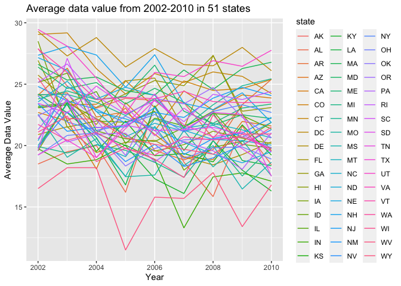
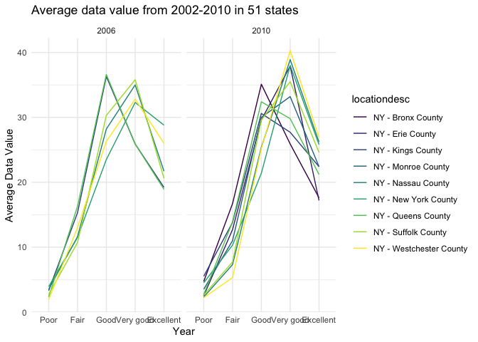
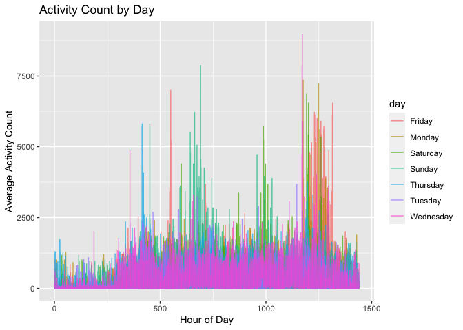

Homework 3
================
Ifrah Fayyaz

Starting assignment and loading data set:

``` r
library(tidyverse)
library(readxl)
library(p8105.datasets)
data("instacart")
```

# Problem 1:

*Description:* The dataset for Instacart contains 15 variables and
1384617 observations. Some key variables include identifiers such as
`product_id`, `user_id` and `order_id`. Other descriptory variables
include `product_name`, `department`, `reordered` and `order_dow`. The
mean number of days between orders is 17.1 days. The most popular
department for orders is *produce* and the most ordered item has been
*Banana*.

#### How many aisles are there, and which aisles are the most items ordered from?

There are a total of 134 aisles, with the fresh vegetables, fresh
fruits, packaged vegetables fruits aisle being the three with the most
items ordered.

#### Make a plot that shows the number of items ordered in each aisle, limiting this to aisles with more than 10000 items ordered. Arrange aisles sensibly, and organize your plot so others can read it.

``` r
instacart %>%
  count(aisle, sort = TRUE) %>%
  filter(n > 10000) %>%
  ggplot(aes(x = reorder(aisle,n), y = n)) + 
    geom_col() +
    coord_flip() +
    labs(x = "Aisle", y = "Count of Items Ordered ", title = "Aisles by count of items ordered") +
    geom_text(aes(label = n), hjust = -0.1, colour = "purple", size = 3) +
    scale_y_continuous(limits = c(-1, 165500)) +
    theme(plot.title = element_text(hjust = 0.1), 
        axis.title.x = element_text(face = "bold", size = 12),
        axis.title.y = element_text(face = "bold", size = 12))
```

<!-- -->

*Description:* The plot above gives the aisle names by the number of
items ordered from that specific aisle. We can see that the
`fresh vegetables` and `fresh fruits` aisle has the greatest number of
items ordered on instacart. The aisle for `butter` and `oil vinegars`
has the least number of orders. The data is arranged in descending order
for reader accessibility listing aisles from most items ordered to
least.

#### Make a table showing the three most popular items in each of the aisles “baking ingredients”, “dog food care”, and “packaged vegetables fruits”. Include the number of times each item is ordered in your table.

``` r
instacart %>%
  filter(aisle == c("baking ingredients", "dog food care", "packaged vegetables fruits")) %>%
  group_by(aisle, product_name) %>%
  summarise(times_ordered = n()) %>%
  arrange(aisle, desc(times_ordered)) %>%
  slice(1:3) %>%
  knitr::kable()
```

| aisle                      | product\_name                                   | times\_ordered |
|:---------------------------|:------------------------------------------------|---------------:|
| baking ingredients         | Light Brown Sugar                               |            157 |
| baking ingredients         | Pure Baking Soda                                |            140 |
| baking ingredients         | Organic Vanilla Extract                         |            122 |
| dog food care              | Organix Grain Free Chicken & Vegetable Dog Food |             14 |
| dog food care              | Organix Chicken & Brown Rice Recipe             |             13 |
| dog food care              | Original Dry Dog                                |              9 |
| packaged vegetables fruits | Organic Baby Spinach                            |           3324 |
| packaged vegetables fruits | Organic Raspberries                             |           1920 |
| packaged vegetables fruits | Organic Blueberries                             |           1692 |

*Description:* The table above shows the three most ordered products
from the `baking ingredients`, `dog food care` and
`packaged vegetables fruits` aisles. The most ordered product from the
list being `organic baby spinach` from the `packaged vegetables fruits`
aisle which has been ordered `3,324` times. Among the 9 listed items,
the least ordered item is the `Original Dry Dog` from the
`dog food care` which has been ordered `9` times.

#### Make a table showing the mean hour of the day at which Pink Lady Apples and Coffee Ice Cream are ordered on each day of the week; format this table for human readers (i.e. produce a 2 x 7 table).

``` r
apple_coffee = instacart %>%
  filter(product_name == c("Pink Lady Apples", "Coffee Ice Cream")) %>%
  select(product_name, order_dow, order_hour_of_day) %>%
  arrange(order_dow) %>%
  mutate(order_dow = recode(order_dow, "0" = "Sunday", "1" = "Monday", "2" = "Tuesday", "3" = "Wednesday", "4" = "Thursday", "5" = "Friday", "6" = "Saturday"))

apple_coffee %>%
  pivot_wider(
    names_from = "product_name",
    values_from = "order_hour_of_day",
    values_fn = mean
  ) %>%
  knitr::kable(digits = 1)
```

| order\_dow | Pink Lady Apples | Coffee Ice Cream |
|:-----------|-----------------:|-----------------:|
| Sunday     |             12.2 |             13.2 |
| Monday     |             11.7 |             15.0 |
| Tuesday    |             12.0 |             15.3 |
| Wednesday  |             13.9 |             15.4 |
| Thursday   |             11.9 |             15.2 |
| Friday     |             13.9 |             10.3 |
| Saturday   |             11.6 |             12.4 |

*Description:* Based on the table above, we can see that
`Pink Lady Apples` are usually ordered early afternoon around 11-12pm on
most days with the exception of `Wednesday` and `Friday` where it is
ordered around 2pm. `Coffee Ice Cream` on the other hand is ordered
mostly around 2-3pm (generally when the temperature is high), with the
exception of `Friday` to `Sunday` where it is ordered a couple of hours
earlier.

# Problem 2:

``` r
library(p8105.datasets)
data("brfss_smart2010")

brfss = brfss_smart2010 %>%
  janitor::clean_names() %>%
  rename(state = locationabbr) %>%
  filter(topic == "Overall Health" & response != "Don't Know/Not Sure" & response != "Refused") %>%
  mutate(response = factor(response, levels = c("Poor", "Fair", "Good", "Very good", "Excellent")))
```

#### In 2002, which states were observed at 7 or more locations? What about in 2010?

``` r
state02 = brfss %>%
  filter(year == 2002) %>%
  group_by(state, locationdesc) %>%
  summarize(num = n()) 

state02 %>%
  group_by(state) %>%
  summarize(locations = n()) %>%
  filter(locations >= 7) %>%
  knitr::kable()
```

| state | locations |
|:------|----------:|
| CT    |         7 |
| FL    |         7 |
| MA    |         8 |
| NC    |         7 |
| NJ    |         8 |
| PA    |        10 |

*Description:* There were 6 states that were observed in 7 or more
locations in 2002 - `Connecticut`, `Florida`, `Massachussetts`,
`North Carolina`, `New Jersey` and `Pennsylvania`.

``` r
state10 = brfss %>%
  filter(year == 2010) %>%
  group_by(state, locationdesc) %>%
  summarize(num = n()) 

state10 %>%
  group_by(state) %>%
  summarize(locations = n()) %>%
  filter(locations >= 7) %>%
  knitr::kable()
```

| state | locations |
|:------|----------:|
| CA    |        12 |
| CO    |         7 |
| FL    |        41 |
| MA    |         9 |
| MD    |        12 |
| NC    |        12 |
| NE    |        10 |
| NJ    |        19 |
| NY    |         9 |
| OH    |         8 |
| PA    |         7 |
| SC    |         7 |
| TX    |        16 |
| WA    |        10 |

*Description:* There were 14 states that were observed in 7 or more
locations in 2010 - `California`, `Colorado`, `Florida`,
`Massachussetts`, `Maryland`, `North Carolina`, `Nebraska`,
`New Jersey`, `New York`, `Ohio`, `Pennsylvania`, `South Carolina`,
`Texas` and `Washington`.

#### Construct a dataset that is limited to Excellent responses, and contains, year, state, and a variable that averages the data\_value across locations within a state. Make a “spaghetti” plot of this average value over time within a state.

``` r
excellent = brfss %>%
  filter(response == "Excellent") %>%
  select(year, state, data_value) %>%
  group_by(year, state) %>%
  summarize(
    avg_data = mean(data_value, na.rm = TRUE)
  )

excellent %>%
  ggplot(aes(x = year, y = avg_data, color = state)) +
  geom_line() + 
  labs(
    title = "Average data value from 2002-2010 in 51 states",
    x = "Year",
    y = "Average Data Value"
  ) 
```

<!-- -->

*Description:* While we do not see a specific trend in data value in the
spaghetti plot, we see that there are generally low average data values
in the year `2005` followed by `2007`. There is no general increasing or
decreasing trend and the graph is not very easy to interpret.

#### Make a two-panel plot showing, for the years 2006, and 2010, distribution of data\_value for responses (“Poor” to “Excellent”) among locations in NY State.

``` r
brfss %>%
  filter(state == "NY", year  %in% c("2006", "2010")) %>%
  ggplot(aes(x = response, y = data_value, group = locationdesc, color = locationdesc)) + 
  geom_line() +
  facet_grid(. ~ year) + 
  labs(
    title = "Average data value from 2002-2010 in 51 states",
    x = "Year",
    y = "Average Data Value"
  ) + 
  scale_color_viridis_d() +
  theme_minimal()
```

<!-- -->

*Description:* We see a similar average value trend for both years; 2006
and 2010. The average data values for `Poor` response is lowest while
`Good` and `Very good` show higher average data values. Since there were
more locations included in 2010 as compared to 2006, we see more data
lines in the 2010 panel.

# Problem 3:

``` r
weekdays = c('Monday', 'Tuesday', 'Wednesday', 'Thursday', 'Friday')

accel = 
  read_csv("accel_data.csv") %>%
  pivot_longer(
    activity.1:activity.1440,
    names_to = "time_min",
    names_prefix = "activity.",
    values_to = "activity_count"
  ) %>%
  mutate(time_min = as.numeric(time_min)) %>%
  mutate(day_type = ifelse(day %in% weekdays, "Weekday", "Weekend")) 
```

*Description:* The Accelerometer data set contains 6 variables and 50400
observations. The variables included are week, day\_id, day, time\_min,
activity\_count, day\_type. The data set contains information on 5 weeks
recording `activity counts` for all `accel %>% pull(time_min) %>% max()`
minutes of the day.

``` r
accel %>%
  group_by(week, day) %>%
  summarize(
    total_activity = sum(activity_count, na.rm = TRUE)
  ) %>%
  knitr::kable(digits = 0)
```

| week | day       | total\_activity |
|-----:|:----------|----------------:|
|    1 | Friday    |          480543 |
|    1 | Monday    |           78828 |
|    1 | Saturday  |          376254 |
|    1 | Sunday    |          631105 |
|    1 | Thursday  |          355924 |
|    1 | Tuesday   |          307094 |
|    1 | Wednesday |          340115 |
|    2 | Friday    |          568839 |
|    2 | Monday    |          295431 |
|    2 | Saturday  |          607175 |
|    2 | Sunday    |          422018 |
|    2 | Thursday  |          474048 |
|    2 | Tuesday   |          423245 |
|    2 | Wednesday |          440962 |
|    3 | Friday    |          467420 |
|    3 | Monday    |          685910 |
|    3 | Saturday  |          382928 |
|    3 | Sunday    |          467052 |
|    3 | Thursday  |          371230 |
|    3 | Tuesday   |          381507 |
|    3 | Wednesday |          468869 |
|    4 | Friday    |          154049 |
|    4 | Monday    |          409450 |
|    4 | Saturday  |            1440 |
|    4 | Sunday    |          260617 |
|    4 | Thursday  |          340291 |
|    4 | Tuesday   |          319568 |
|    4 | Wednesday |          434460 |
|    5 | Friday    |          620860 |
|    5 | Monday    |          389080 |
|    5 | Saturday  |            1440 |
|    5 | Sunday    |          138421 |
|    5 | Thursday  |          549658 |
|    5 | Tuesday   |          367824 |
|    5 | Wednesday |          445366 |

*Description:* There are not any specific trends observed. However, 2
consecutive Saturdays for weeks `4` and `5` record the lowest activity
count - it is possible that the accelerometer was not used those days.
`Monday` generally shows the less physical activity with the exception
to the Monday in week `2`.

``` r
accel %>%
  ggplot(aes(x = time_min, y = activity_count, group = day, color = day)) + 
  geom_line(alpha = 0.7) +
  labs(
    title = "Activity Count by Day",
    x = "Hour of Day",
    y = "Average Activity Count"
  ) 
```

<!-- -->

*Description:* We see that there is very less activity in the first
`250` minutes of the dat as well as the last `100` minutes of the day.
That can be because of no activity due to sleep. Much of the activity is
seen from `400-1300` minutes where the 63 year-old male had been
working.
